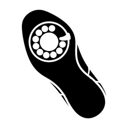

<!--
  SPDX-FileCopyrightText: 2026 Curtis Galloway
  SPDX-License-Identifier: Apache-2.0
-->

# shoephone



Phone-approved, short-lived SSH certificates for coding agents.

A coding agent that runs machines needs two kinds of access. Reading logs,
status and disk should be promptless, because a prompt on every command gets
approved without being read. Admin work should cost one deliberate approval,
made on a device the agent cannot touch. shoephone handles the admin half.

1. The agent runs `shoephone request web01 --reason "..."`. Its terminal
   prints a short match code.
2. The person's phone shows the same code, the host, the admin account and
   how long the access will last.
3. The person checks that the codes match and approves with Face ID. The
   phone signs exactly what it showed.
4. The daemon issues an SSH certificate that works only on `web01`, only for
   the key that asked, and only until the approved time runs out.

A decline or a timeout issues nothing.

The name comes from Get Smart: the approver is a phone, and the agency is
CONTROL.

**Terms**

- **Agent:** a program such as Claude Code that runs shell commands for you,
  including `ssh`.
- **SSH certificate:** a public key signed by a certificate authority (CA).
  sshd accepts it in place of an `authorized_keys` entry.
- **Principal:** a name inside the certificate. Each host accepts only its
  own, which is how a certificate is limited to one host.
- **Window:** the span of time the person approved. Certificates are issued
  inside it and never outlive it.
- **Match code:** a short code shown on both the terminal and the phone, so
  the person knows which request they are approving.
- **WebAuthn:** the web standard for signing a server's challenge with a key
  held on a device.

## Status

Deployed.

- **`shoephoned`**, the daemon, holds the CA, enforces every limit, enrolls
  approver devices, sends push notifications, and logs every outcome.
- **`shoephone`**, the CLI, requests, renews and ends access, and loads
  certificates into ssh-agent.
- **The approver** is the iOS app
  [shoephone-app](https://github.com/curtisgalloway/shoephone-app), with its
  key in the Secure Enclave behind Face ID, or a hardware security key on the
  daemon's web page.

Read [docs/DESIGN.md](docs/DESIGN.md) before deploying. shoephone protects
nothing if the agent can already read admin credentials from a vault, apply
changes from your infrastructure repository, or delete backups without a
credential.

## Using the CLI

```bash
export SHOEPHONE_DAEMON=https://approve.example.internal   # or ~/.config/shoephone/config.toml
shoephone doctor                # checks everything a request needs
shoephone request web01 --reason "rotate the TLS cert; needs a service restart"
ssh agent-admin@web01 sudo systemctl restart something
shoephone renew web01           # the next 15-minute certificate, no second approval
shoephone disavow web01         # end the window early
```

`request` prints the match code, waits for the phone, and loads the
certificate into ssh-agent. `shoephone --skill` prints the full contract for
agents, including every exit code.

## Deploying the daemon

Run `shoephoned` on a small machine outside the failure domain of the hosts
it signs for, with no agent account of any kind. Admin on that machine is for
humans only.

Four settings must be right:

- The state directory, the CA key and the config file are readable by root
  only. The config holds push tokens.
- The daemon serves plain HTTP on loopback. A reverse proxy in front provides
  TLS, which WebAuthn requires.
- `rp_origin` is the exact https origin the phone loads, and `rp_id` is its
  hostname. If either is wrong, every enrollment and approval fails.
- The daemon and every host it signs for keep their clocks in sync (NTP is
  enough). A host whose clock runs slow accepts a certificate past the end of
  the approved window.

### 1. Build and install

```bash
cargo build --release      # never add --features test-hooks for a deployed daemon
install -m 0755 target/release/shoephoned /usr/local/bin/
install -d -m 0700 /etc/shoephone
install -m 0600 shoephoned.toml /etc/shoephone/shoephoned.toml
```

That config path is the default; `--config <file>` overrides it. The host
needs libssl, which `webauthn-rs` links.

### 2. Configure

```toml
listen = "127.0.0.1:7391"          # only the reverse proxy connects
state_dir = "/var/lib/shoephone"   # root-only; the systemd unit creates it
ca_key = "/var/lib/shoephone/user_ca"
rp_id = "approve.example.internal"
rp_origin = "https://approve.example.internal"

[principals]                        # the hosts this daemon signs for
web01 = "agent-admin:web01"

[apns]                              # optional: push to the Shoephone app
key_file = "/etc/shoephone/apns.p8" # APNs auth key, root-only
key_id = "ABC123DEFG"
team_id = "TEAM000000"
topic = "xyz.curtisg.shoephone"     # the app's bundle id
sandbox = true                      # true for an app installed from Xcode

[notify]                            # optional: push to an ntfy-style topic
url = "https://ntfy.example.internal/shoephone"
token = "..."                       # if the topic is protected
click = "https://approve.example.internal"

[access]                            # optional: a Cloudflare Access service token
client_id = "....access"            # for a daemon behind a Cloudflare Tunnel;
client_secret_file = "/etc/shoephone/access.secret"
                                    # the enrollment QR carries it to the app
```

**Push.** Both channels announce three events and nothing else: a request is
waiting, a window opened, a window was killed. The app fetches details when
opened.

**Synced passkeys are refused,** at enrollment and at every approval. A
passkey synced through iCloud Keychain or 1Password also exists on the
computer the agent runs on. `allow_synced_credentials = true` admits them as
a stopgap, and the daemon lists each such device at startup.

**Limits.** A `[policy]` table overrides these defaults:

| Key | Default | Meaning |
|---|---|---|
| `default_window_minutes` | 60 | how long an approval lasts |
| `max_window_minutes` | 240 | the longest window a request may ask for |
| `cert_ttl_minutes` | 15 | lifetime of each certificate inside the window |
| `pending_ttl_minutes` | 5 | how long a request waits for the phone |
| `base_cooldown_minutes` | 5 | wait after a decline or timeout; doubles on each repeat |
| `max_cooldown_minutes` | 60 | the cap on that doubling |
| `max_requests_per_hour` | 6 | accepted requests per rolling hour, across all requesters |

### 3. Create the CA and start the service

```bash
shoephoned init-ca > user_ca.pub
cp contrib/systemd/shoephoned.service /etc/systemd/system/
systemctl enable --now shoephoned
journalctl -u shoephoned -f
```

`init-ca` writes the key at mode 0600 and never overwrites one. The
[systemd unit](contrib/systemd/shoephoned.service) runs as root but drops all
capabilities, keeps the filesystem read-only outside the state directory,
and filters system calls. A restart keeps enrolled devices and drops open
windows and pending requests.

### 4. Put TLS in front

Any reverse proxy works. With Caddy:

```
approve.example.internal {
    reverse_proxy 127.0.0.1:7391
}
```

The phone must trust the certificate. A private CA in the phone's trust store
is fine, and the CLI uses the machine's trust store, so the same CA works
there.

### 5. Enroll the phone

At the daemon host's console, never in a session an agent can see:

```bash
shoephoned enroll --name phone
```

This prints a QR code and a one-time code, good for ten minutes or five wrong
guesses. In the Shoephone app, scan the QR (or type the code) and pass Face
ID. For a hardware security key instead, open `rp_origin` in a browser, enter
the code, and tap the key.

A passkey made in Safari on an iPhone will not work: iOS makes only synced
passkeys. To add a second device, enroll again with a different name. By
default every enrolled device is notified when a window opens or is killed,
so an approval on one shows up on the others.

`shoephoned devices` lists enrolled devices; `shoephoned forget --id
<handle>` removes one.

### 6. Trust the CA on each host

On every host in `[principals]`, add to `sshd_config`:

```
Match User agent-admin
    TrustedUserCAKeys /etc/ssh/shoephone_user_ca.pub
    AuthorizedPrincipalsFile /etc/ssh/principals/%u
    AuthorizedKeysFile none
```

Put that host's principal, and only that one, in
`/etc/ssh/principals/agent-admin`, for example `agent-admin:web01`. A
certificate for another host is then refused, no static key can sit beside
it, and no other account trusts the CA.

## Building

```bash
cargo build --release
target/release/shoephone --skill
```

## License

Apache 2.0. See [LICENSE](LICENSE).
